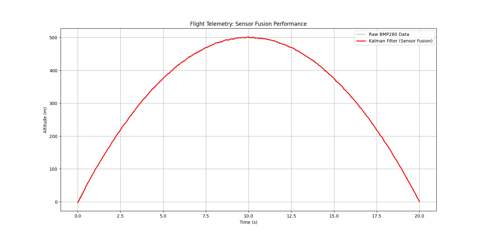

## Theoretical Framework
To achieve high-fidelity altitude estimation, we implement a **Linear Kalman Filter** for **Sensor Fusion**.

### The Problem
- **BMP280 (Barometer):** Provides absolute altitude but suffers from signal noise and atmospheric lag.
- **MPU6050 (Accelerometer):** Extremely responsive to vertical movement but suffers from integration drift.

### The Solution: Kalman Filter
We use a 1D Kalman Filter to fuse data from both sensors. The state vector is defined as:
$$P = P_0 \cdot \left(1 - \frac{L \cdot h}{T_0}\right)^{\frac{g \cdot M}{R \cdot L}}$$
where $h$ is altitude and $v$ is vertical velocity.

The algorithm follows two steps:
1. **Prediction:** Uses the MPU6050's Z-axis acceleration to predict the next state.
2. **Correction:** Uses the BMP280's barometric altitude to correct the prediction.

## Files
* `generate_test_data.py`: Script to generate synthetic flight data with Gaussian noise.
* `flight_analysis.py`: Main analysis script implementing the Kalman Filter.
* `flight_log.csv`: Sample flight data.
* `analysis_result.png`: Visualization of Raw vs. Filtered data.

## Results
The image below shows how the Kalman Filter (red line) successfully tracks the flight path while filtering out the sensor noise from the BMP280.

